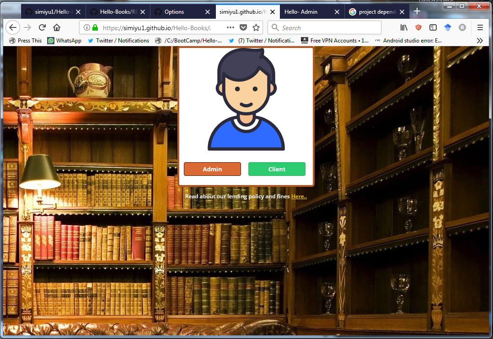
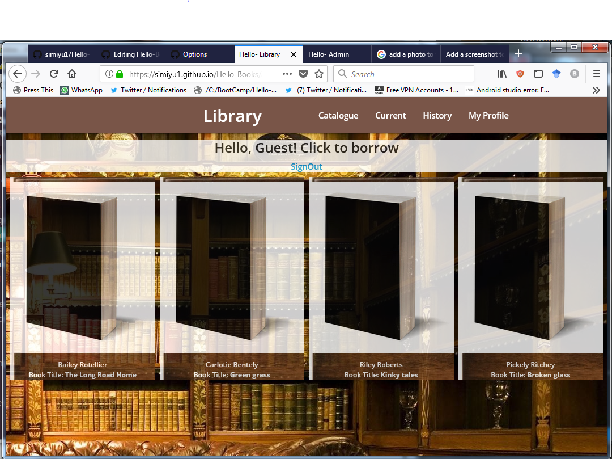
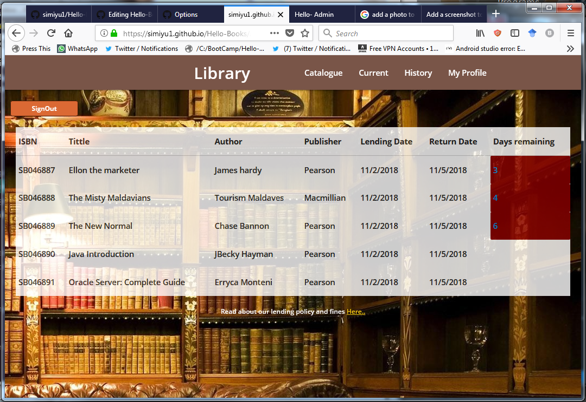
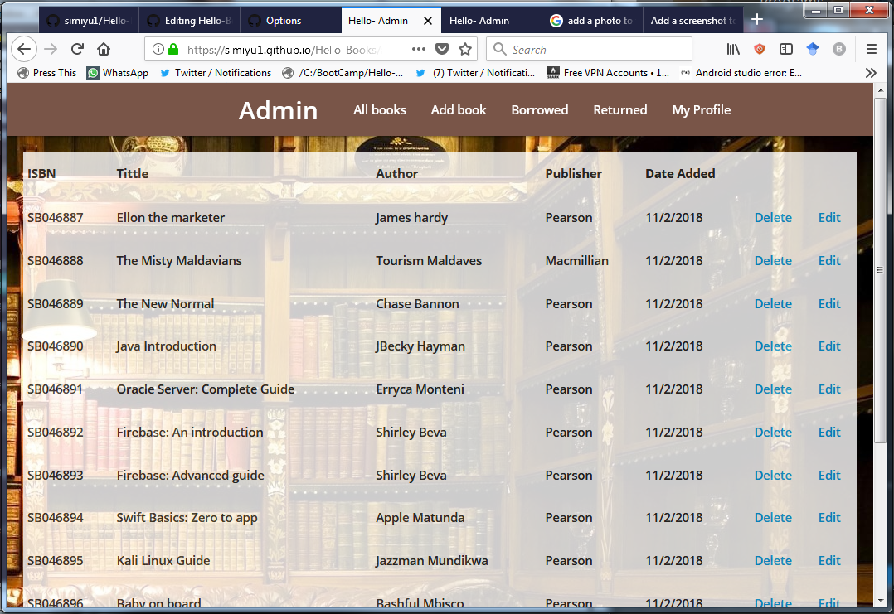
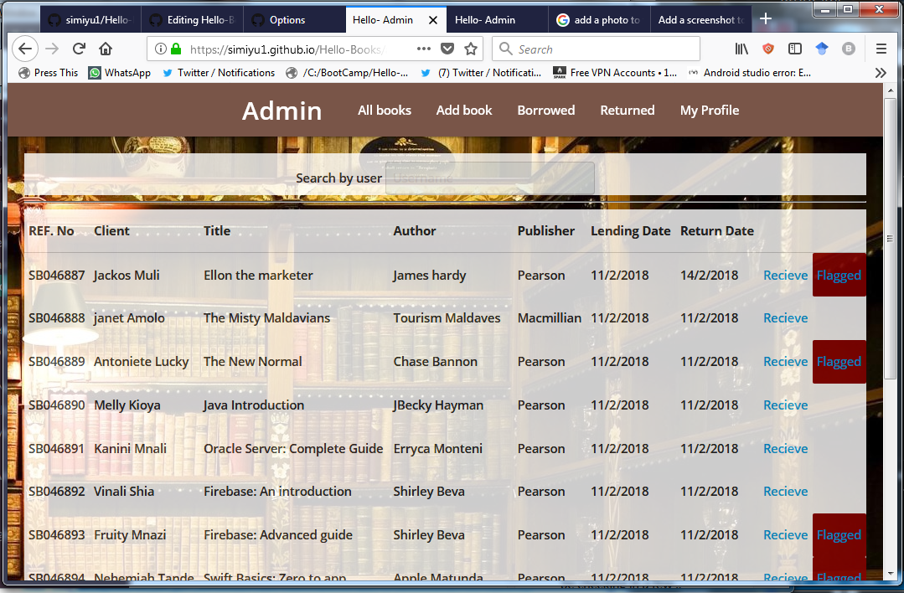

# Hello-Books
Hello-Books is a bare-bones application to automate the library processes with actions like stocking, tracking, and renting books.

Upon completion of the first build it will feature:

    Admins will be able to 1. Add a a bookto the catalogue
                           2. Update book information
                           3. Remove a book form the catalogue
                           4. View all books
                           5. View all books pending return
                           6. View books by user
    Users will be able to 1. Borrow a book
                          2. Return a book
                          3. Search for books

Dependencies

The current dependencies are 

    MaterializeCSS
    html5

Installation and setup

There are two ways you may view this project. Locally or on Gitpages(Only UI)

A. Locally
  Viewing it locally will require:
    Git
    A browser
    Flask(When core functionalities are added)
    Please check the requirements file for the necessary system configurations
    
 Procedure:

        In your directory of choice, initialise git and clone this repository as shown below
        
        `git clone https://github.com/simiyu1/Hello-Books/settings`
        
        In the resulting folder, navigate to `app/designs/UI/` directory and launch the index file in your browser of choice.

B. In Git Pages
    Launch your browser and go to the URL https://simiyu1.github.io/Hello-Books/ . From there you can navigate either into the Admin template by clicking on the admin button or the client side by clicking the client button. No Username or password will be asked.
    
Screen shots

Here are a few screenshots of what to expect.
A. Login

B. Client page

C. Client Views borrowed books

D. Admin page

E. Admin views all borrowed

F. Admin Profile page

    
 Contributions:
 Given the nature of this project. I cannot accept any contributions to it however, edit sugestions on the design are highly welcome. You may clone and use this project as you wish in any manner as long as you are within the bounds of the law.
 
 
       

